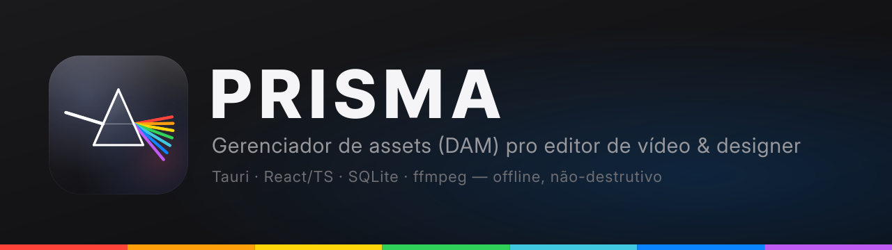
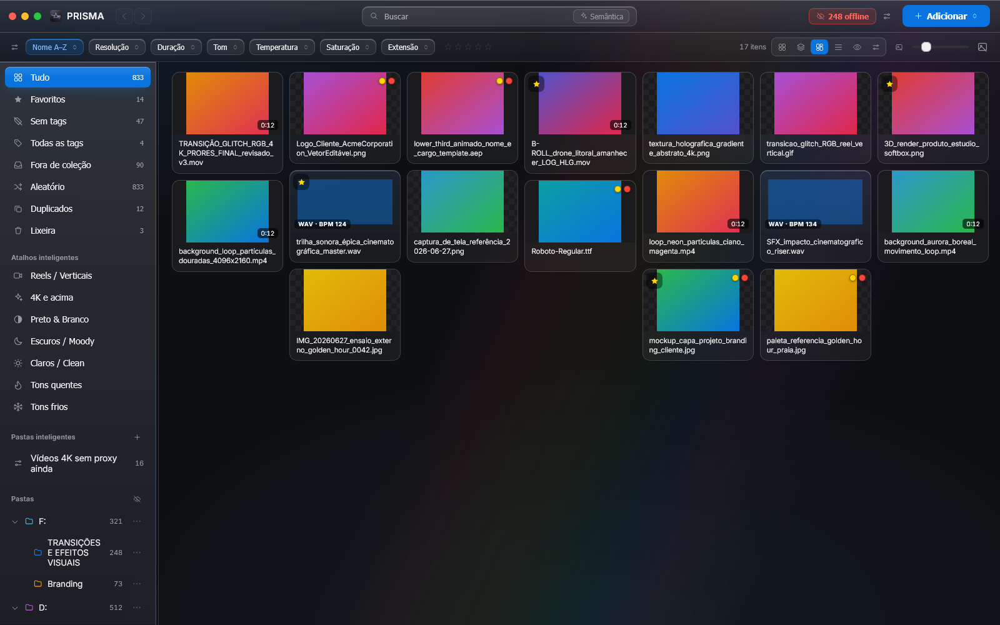
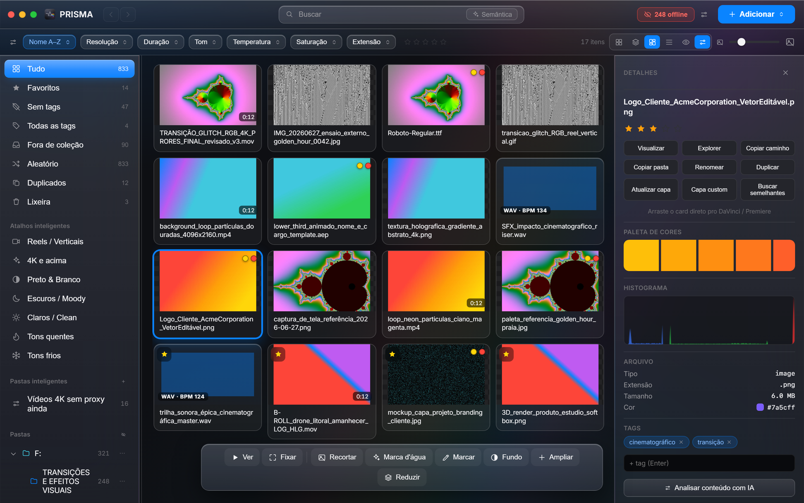

# PRISMA

### Acha qualquer arquivo em segundos e entrega ele pronto pro corte.

**A biblioteca de mídia que um editor de vídeo construiu porque cansou de caçar asset em HD.**
Cataloga suas pastas onde elas já estão, prepara o material pro DaVinci sem retrabalho e roda 100% no seu PC — sem nuvem, sem mensalidade, sem tocar nos seus originais.

---

## Você conhece essa dor

Milhares de clipes espalhados em três HDs. Nomes que não dizem nada. O ProRes que não toca no player. O clipe que trava o Resolve na hora errada. E aquele B-roll perfeito que você **sabe** que baixou — mas não faz ideia de onde.

Achar o asset certo virou uma caçada. E caçada não paga o boleto: rouba as horas que deviam ser de edição.

**O PRISMA acaba com a caçada.** Ele transforma o caos das suas pastas numa parede de mídia rápida, pesquisável e pronta pra editar — sem mover, copiar, renomear ou alterar um único arquivo original.

---

## O que você ganha

### Acha qualquer coisa em segundos
Busque por **nome, cor, tom, temperatura, duração** ou até por **significado** — digite "pôr do sol na praia" e a busca semântica local (CLIP) encontra, mesmo que o arquivo se chame `IMG_20260627_0042.jpg`. Tudo offline, nada sai do seu PC.

### Prepara pro DaVinci sem retrabalho
O PRISMA lê os metadados de cor de cada clipe e te diz a **configuração de CST certa pro DaVinci Resolve** (709, S-Log3, HLG, Apple Log…). Gera **proxies H.264 automáticos** pra ProRes/DNxHR tocarem na hora, sem engasgo. Arraste o card direto pra timeline do Resolve ou do Premiere.

### Conserta o que trava a edição
Selos de diagnóstico apontam **VFR, banding, áudio mudo e codec pesado** — e um clique **conserta** (VFR→CFR, anti-banding, proxy). Sempre em arquivo novo. Seu original nunca é tocado.

### IA que roda na sua máquina
Auto-tag, descrição por conteúdo, **ampliar imagem 4x** (Real-ESRGAN) e **remover fundo** (ONNX em Rust) — embutidos, sem plugin. A IA é opcional e usa a **sua** chave; a imagem só é analisada quando você clica.

### Baixa direto da web, já catalogado
YouTube, Instagram, áudio, vídeo em alta — cola o link e o PRISMA baixa e cataloga sozinho. Referência entra na biblioteca sem sair do app.

### Caixa de ferramentas do editor, nativa
Marca d'água, OCR, GIF, folha de contatos, recorte, comparar, QR, forma de onda com BPM, player com letra sincronizada, RAW/HEIC/JXL e Live Photo — tudo dentro, sem instalar mais nada.

### Seguro por design
**Nunca toca nos originais.** Roda 100% local, sem servidor, sem login, sem nuvem. Sua biblioteca é sua, no seu disco.

---

## Veja funcionando

Parede de mídia: filtros por cor, tom, temperatura e saturação · selos de condição · busca semântica

  

Inspetor: paleta extraída, histograma, tags, "arraste direto pro DaVinci" e as ferramentas de preparo

---

## Por que PRISMA (e não o Eagle)

O Eagle é ótimo pra imagem. Mas ele nunca editou um vídeo. O PRISMA faz **tudo que o Eagle faz — e o que só quem finaliza vídeo sabe que falta.**

| | **PRISMA** | Eagle |
|---|:---:|:---:|
| Organizar, tags, busca por cor | ✅ | ✅ |
| Offline, sem conta, não-destrutivo | ✅ | ✅ |
| Busca por IA (imagem / significado) | ✅ | ✅ |
| Marca d'água, OCR, GIF, folha de contatos | ✅ | ✅ |
| **CST de cor pro DaVinci Resolve** | ✅ | ❌ |
| **Proxies automáticos (ProRes etc.)** | ✅ | ❌ |
| **Diagnóstico + conserto (VFR, banding)** | ✅ | ❌ |
| **Baixar de YouTube / Instagram** | ✅ | ❌ |
| **Ampliar 4x + remover fundo com IA** | ✅ | ❌ |
| Preço | **R$ 150 · uma vez, vitalício** | US$ 34,95 |

---

## Preço justo, sem surpresa

**Baixe e teste de graça.** O núcleo — organizar, achar, prever, favoritar — é seu pra sempre, e você ainda começa com **3 dias de Pro completo**.

Quando quiser todo o poder de preparo e IA, o **Pro é pagamento único**:

### R$ 150 — uma vez. Vitalício. Roda em 2 PCs. Sem assinatura.

**O Pro libera:** IA (busca, auto-tag, upscale, remover fundo) · CST DaVinci + proxies + conserto · baixar do YouTube/Instagram · marca d'água, GIF, folha de contatos, OCR · **uso comercial.**

➡️ **[paulocodex.com/comprar?product=prisma](https://paulocodex.com/comprar?product=prisma)**

Pagamento seguro no cartão, **direto no site** — sua chave chega na hora, sem redirecionar pra loja nenhuma. Você cola a key no primeiro launch e o PRISMA fica seu. As atualizações chegam sozinhas (auto-update assinado).

---

## O mascote

Um prisma de vidro que **sorri quando a luz entra** — recebe o feixe branco da sua mídia crua e o decompõe no espectro da marca. É exatamente o que o app faz: pega o caos e devolve organizado, colorido e legível.

---

## Requisitos

- **Windows 10 (build 1809+)** ou **Windows 11** (x64)
- **WebView2 Runtime** — já vem no Windows 11; no Windows 10, [aka.ms/webview2](https://developer.microsoft.com/microsoft-edge/webview2/)
- **Visual C++ Redistributable 2015–2022 (x64)** — [aka.ms/vs/17/release/vc_redist.x64.exe](https://aka.ms/vs/17/release/vc_redist.x64.exe)
- Opcional: GPU dedicada pra acelerar proxies e preview de codecs pesados

Instalador autocontido (ffmpeg embutido). Versão para **Mac vem a seguir**.

---

## 👤 Sobre o desenvolvedor

**Paulo Adriel** é produtor de vídeo e desenvolvedor indie brasileiro. Construo o produto **e** a apresentação dele — código + identidade visual, motion e material de lançamento — do zero ao ar em 30 dias. Trabalho de forma aberta e escuto quem usa. Estúdio [**Paulocodex**](https://paulocodex.com).

 

---

📧 [paulobatista19988@proton.me](mailto:paulobatista19988@proton.me) &nbsp;·&nbsp; 🌐 [paulocodex.com](https://paulocodex.com) &nbsp;·&nbsp; 📸 [Instagram](https://instagram.com/paulo.videodev) &nbsp;·&nbsp; 💼 [LinkedIn](https://www.linkedin.com/in/paulo-adriel/) &nbsp;·&nbsp; 🐙 [github.com/Paulothedeveloper](https://github.com/Paulothedeveloper)

_Repositório de **apresentação pública** — o código-fonte é fechado. Nada de dado ou segredo aqui._

