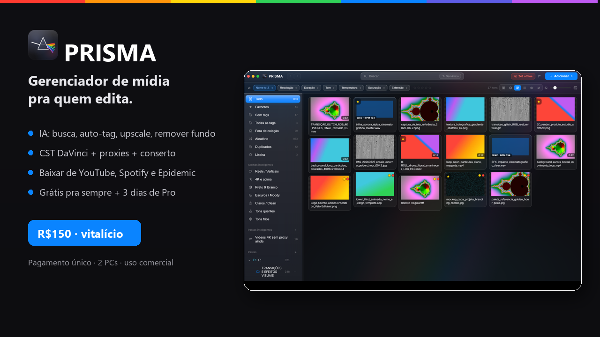
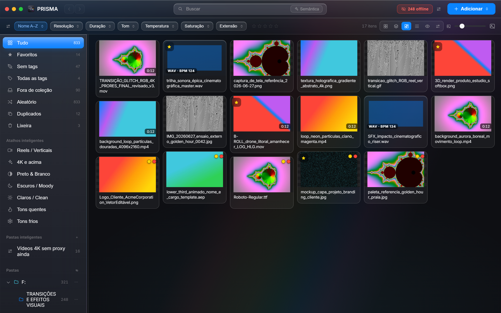

# PRISMA

### Gerenciador de mídia feito pra quem edita.

Ache qualquer arquivo em segundos, organize a biblioteca inteira e prepare tudo pro corte — **sem tocar nos seus originais**. Editor de vídeo e designer no mesmo app.

---

## 🎁 Grátis pra sempre + 3 dias de Pro

O **núcleo é grátis pra sempre**: organizar, achar, prever, tags, coleções, duplicados, forma de onda + BPM. E todo novo usuário ganha **3 dias de Pro completo** pra testar tudo — sem cartão, sem pegadinha. Passou os 3 dias, você continua no núcleo grátis (nada é bloqueado além dos recursos Pro).

## ✦ O que o Pro libera

| | Grátis | **Pro** |
|---|:---:|:---:|
| Organizar, tags, coleções, busca por cor/nome | ✅ | ✅ |
| Prévia de tudo (vídeo, áudio+BPM, fonte, imagem) | ✅ | ✅ |
| Duplicados, favoritos, não-destrutivo | ✅ | ✅ |
| **IA**: busca por conteúdo, auto-tag, upscale, remover fundo | — | ✅ |
| **CST DaVinci** + proxies + conserto de mídia | — | ✅ |
| **Baixar** de YouTube, Spotify e Epidemic Sound | — | ✅ |
| Marca d'água, GIF, contact-sheet, OCR e mais | — | ✅ |
| Uso comercial · 2 PCs | — | ✅ |

## 💳 Comprar

Pagamento **único**, licença **vitalícia** (sem mensalidade), ativa em **2 PCs**.

**→ [Comprar o Pro por R$150](https://pauloadriel98.gumroad.com/l/prisma)**

Depois de comprar você recebe uma **chave**. Baixe o app, abra **Configurações → Pro** e cole a chave. Pro liberado nesse PC.

## ⬇️ Baixar

**→ [Última versão (Windows)](https://github.com/Paulothedeveloper/prisma-app/releases/latest)**

Atualizações automáticas dentro do app.

---

Feito pra editores de vídeo e designers. Seus originais **nunca** são movidos nem alterados.

